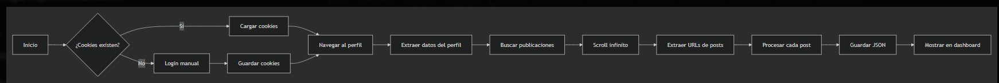

📸 Instagram Scraper

📋 Tabla de Contenidos

Descripción General

Requisitos Previos

Instalación

Estructura del Proyecto

Cómo Funciona

Ejecución del Scraper

Dashboard Web

Solución de Problemas Comunes

Limitaciones y Consideraciones

📝 Descripción General
Este proyecto es un scraper de Instagram que extrae información de perfiles públicos sin necesidad de API oficial. Utiliza Playwright para simular un navegador real y cookies persistentes para mantener la sesión.

✨ Características Principales

✅ Extrae datos del perfil (username, biografía, estadísticas)

✅ Obtiene URLs de publicaciones

✅ Extrae metadatos (fechas, likes, descripciones)

✅ Identifica hashtags y menciones

✅ Guarda datos en formato JSON estructurado

✅ Panel web para visualización de datos

✅ Sistema de cookies para evitar login repetido

⚠️ Limitaciones

❌ Las imágenes no se descargan (Instagram bloquea con error 403

❌ No extrae comentarios reales de usuarios

❌ Solo funciona con cuentas públicas

💻 Requisitos Previos
* Versiones recomendadas
Python 3.8 o superior
Node.js 14+ (opcional, para el dashboard)

* Instalar dependencias
pip install playwright==1.40.0 requests==2.31.0
playwright install chromium

* Estructura de carpetas

instagram_scraper/
├── data/
│   ├── instagram_cookies.json
│   └── resultados/
│       └── perfil_extraido.json
├── scraper/
│   ├── __init__.py
│   ├── browser.py      # Gestión de cookies y navegador
│   ├── profile.py      # Extracción de datos del perfil
│   ├── posts.py        # Extracción de publicaciones
│   └── display.py      # Visualización en consola
├── web_dashboard/
│   ├── index.html      # Panel web principal
│   ├── style.css       # Estilos del dashboard
│   ├── script.js       # Lógica del frontend
│   └── server.py       # Servidor local
├── downloads/          # Carpeta para imágenes (vacía)
├── main.py            # Punto de entrada principal
└── requirements.txt

🚀 Cómo Funciona
Flujo de Trabajo

* Explicación Técnica
Gestión de Cookies (browser.py)
Guarda las cookies después del primer login
Las reutiliza en ejecuciones posteriores
Evita tener que iniciar sesión cada vez
* Extracción de Datos (profile.py y posts.py)
Usa selectores CSS para encontrar elementos
Implementa delays para simular comportamiento humano
Maneja scroll infinito para cargar más posts
* Almacenamiento
JSON estructurado con indentación (formato vertical)
Fechas en formato ISO 8601
Separación clara entre perfil y publicaciones

🏃 Ejecución del Scraper
Paso 1: Configurar el objetivo
Edita main.py y cambia el username:
TARGET_USERNAME = "nasa"  # Cambia por la cuenta que quieras
MAX_POSTS = 10  # Número de posts a extraer

* Paso 2: Ejecutar el scraper
python main.py

* Paso 3: Login manual (SOLO la primera vez)
1.- Se abrirá una ventana de Chrome
2.- Inicia sesión manualmente en Instagram
3.- Espera a que cargue el feed principal
4.- Presiona ENTER en la terminal

* Paso 4: Resultados
Los datos se guardan en data/resultados/perfil_extraido.json
Verás la salida en la terminal con los datos extraídos

* Salida en consola
🚀 Iniciando Instagram Scraper...
🎯 Cuenta objetivo: @nasa
✅ Cookies cargadas. Sesión restaurada.
🔍 Navegando a https://www.instagram.com/nasa/
📊 Datos: 89.5M seguidores, 4761 posts
📜 Buscando 10 posts...
   ✅ Encontrados 5 posts...
   ✅ Encontrados 12 posts...
✅ Total posts encontrados: 10
📸 Extrayendo detalles de 10 posts...
================================================================================
📊 INSTAGRAM SCRAPER - RESULTADOS
================================================================================
👤 PERFIL: nasa
   📝 Bio: Explore the universe...
   📸 Posts: 4761
   👥 Seguidores: 89.5M
💾 Datos guardados en: data/resultados/perfil_extraido.json

🖥️ Dashboard Web
Iniciar el servidor web
cd web_dashboard
python server.py

* Acceder al dashboard
Abre tu navegador en: http://localhost:8000

Funcionalidades del Dashboard
📊 Visualización del perfil con estadísticas
🖼️ Grid de publicaciones (tarjetas interactivas)
🔍 Modal con detalles completos de cada post
📁 Crga manual de archivos JSON
🔄 Actualización automática de datos

* Captura del Dashboard
┌─────────────────────────────────────────────┐
│  📸 Instagram Scraper                       │
│  Dashboard de visualización                 │
├─────────────────────────────────────────────┤
│  [🔄 Actualizar Datos] [📁 Cargar JSON]     │
├─────────────────────────────────────────────┤
│  ┌─────┐  @nasa                             │
│  │ 👤 │  Explore the universe...           │
│  └─────┘  4.8K Posts  89.5M Seguidores     │
├─────────────────────────────────────────────┤
│  📸 Publicaciones Recientes                 │
│  ┌──────────┐ ┌──────────┐ ┌──────────┐   │
│  │ 📸 Post1 │ │ 📸 Post2 │ │ 📸 Post3 │   │
│  │ ❤️ 1.2M │ │ ❤️ 856K │ │ ❤️ 2.1M │   │
│  └──────────┘ └──────────┘ └──────────┘   │
└─────────────────────────────────────────────┘

📊 Estructura del JSON de Salida

json

{
  "fechaExtraccion": "2026-04-22T10:50:57.740668",
  "perfil": {
    "username": "nasa",
    "bio": "Explore the universe...",
    "posts_count": "4761",
    "followers_count": "89.5M",
    "following_count": "342"
  },
  "totalPostsEncontrados": 10,
  "exitosos": 10,
  "publicaciones": [
    {
      "url": "https://www.instagram.com/nasa/p/DXPduuvEY7S/",
      "tipo": "imagen",
      "likes": "1,234,567",
      "descripcion": "Texto de la publicación...",
      "fecha": "2026-04-17T17:45:15.000Z",
      "hashtags": ["NASA", "Space", "Artemis"],
      "menciones": ["astro_reid", "astro_christina"],
      "imagenes": [],
      "comentarios": [],
      "post_id": "DXPduuvEY7S"
    }
  ]
}

🔒 Limitaciones y Consideraciones

Éticas y Legales

✅ Solo para cuentas públicas

✅ Respetar robots.txt de Instagram

✅ No usar para fines comerciales sin permiso

✅ Implementar delays para no sobrecargar servidores

Técnicas

❌ No descarga imágenes (bloqueado por Instagram)

❌ No extrae comentarios reales (requiere scroll adicional)

⚠️ Los selectores CSS pueden cambiar (Instagram actualiza su HTML)

⚠️ Puede ser bloqueado si se hacen muchas peticiones rápidas

Recomendaciones para evitar bloqueos

Usar delays entre acciones

page.wait_for_timeout(3000)  # 3 segundos

Limitar número de posts

MAX_POSTS = 10  # No extraer demasiados

Usar User-Agent realista

user_agent='Mozilla/5.0 (Windows NT 10.0; Win64; x64) AppleWebKit/537.36'

📚 Comandos Rápidos de Referencia

Ejecutar scraper
python main.py

Iniciar dashboard

cd web_dashboard && python server.py

Limpiar cookies (forzar nuevo login)

del data\instagram_cookies.json  # Windows

Ver imágenes descargadas (si las hay)
python view_images.py

📄 Licencia
Este proyecto es educativo. Úsalo responsablemente y respeta los términos de servicio de Instagram.

🎯 Resumen Ejecutivo
Qué hace	     Cómo lo hace	     Limitación
Extrae perfil	 Selectores CSS	     Solo público
Obtiene posts	 Scroll infinito	 Máx 20-30 posts
Guarda datos	 JSON estructurado	 Sin imágenes
Visualiza	     Dashboard web	     Datos locales

* Mantén los delays entre 2-5 segundos para evitar bloqueos.